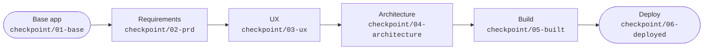

<div align="center">

<picture>
  <source media="(prefers-color-scheme: dark)" srcset="public/logo/checkinn-logo-on-dark.webp">
  <source media="(prefers-color-scheme: light)" srcset="public/logo/checkinn-logo-on-light.webp">
  
</picture>

<p><strong>Hotel booking with a short path from "I need somewhere to stay" to a confirmed stay.</strong></p>

[](https://github.com/Dynamic-Visual-Technologies-PTY-LTD/checkinn/actions/workflows/ci.yml)
[](LICENSE)
[](.nvmrc)
[](https://nextjs.org)
[](https://react.dev)
[](tsconfig.json)
[](https://tailwindcss.com)
[](vitest.config.mts)
[](playwright.config.ts)

[Quick start](#quick-start) · [Scripts](#scripts) · [Stack](#stack) · [The workshop](#the-workshop) · [Repository map](#repository-map) · [Contributing](#contributing)

</div>

> [!NOTE]
> **Status: project shell.** The app is a placeholder home page. The booking system itself has not been built yet.

## What it is

CheckInn is a simple hotel-booking web application: a guest searches for a hotel, views it, and books a stay. Finding the right hotel should not take a dozen filters, so the path from search to booking is kept short.

The planned enhancement is **intelligent search**. A guest describes what they want in plain language and the results are ranked by how well they match.

CheckInn is also the demo application for DVT's AI-SDLC workshop at AI Africa, where that enhancement is built live. See [The workshop](#the-workshop).

## Quick start

You need Node.js 24 (see [`.nvmrc`](.nvmrc)). No database, API keys or other services are required.

```bash
npm install
npm run dev
```

Then open http://localhost:3000.

## Scripts

| Command | What it does |
|---|---|
| `npm run dev` | Start the dev server |
| `npm run lint` | ESLint |
| `npm run typecheck` | Generate Next.js route types, then run the TypeScript check |
| `npm test` | Unit and component tests (Vitest) |
| `npm run test:watch` | The same tests in watch mode |
| `npm run test:e2e` | End-to-end tests in a real browser (Playwright) |
| `npm run test:e2e:ui` | The same tests in Playwright's interactive UI |
| `npm run design:lint` | Validate the design tokens in `DESIGN.md` |
| `npm run build` | Production build |
| `npm start` | Serve the production build |

<details>
<summary><strong>Running the end-to-end tests</strong></summary>

<br>

The end-to-end tests need a browser, downloaded once:

```bash
npx playwright install chromium
```

They start the dev server themselves, or reuse one that is already running on port 3000. They run against a desktop and a mobile viewport.

</details>

<details>
<summary><strong>Using VS Code</strong></summary>

<br>

The same commands are available under **Tasks: Run Task**. The `verify` task runs lint, typecheck, test and build in sequence.

The Run and Debug panel has configurations for debugging the server, the browser, both together, and the current test file.

</details>

## Stack

| Area | Choice |
|---|---|
| Runtime | Node.js 24 |
| Language | TypeScript, `strict` |
| Framework | Next.js 16, App Router, Turbopack |
| UI | React 19 |
| Styling | Tailwind CSS 4 |
| Unit and component tests | Vitest, Testing Library, jsdom |
| End-to-end tests | Playwright, Chromium |
| Linting | ESLint with `eslint-config-next` |
| CI | GitHub Actions |

It is one full-stack Next.js app. There is no separate API service.

<details>
<summary><strong>Agreed, not installed yet</strong></summary>

<br>

| Area | Choice |
|---|---|
| Database | SQLite, embedded in the app |
| Data access | Drizzle ORM with `better-sqlite3` |
| Vector search | `sqlite-vec`, for the search enhancement |
| Hosting | Azure |
| Infrastructure as code | Bicep or Terraform, undecided |

</details>

## The workshop

The AI Africa session takes this system and runs one enhancement, intelligent search, through an AI-assisted software lifecycle. Each stage is handed from one role to the next, and each ends with a git tag so the presenters can jump to a known-good state.



None of the checkpoint tags exist yet. They are created as each stage is rehearsed.

The agenda, roles and open items are in [docs/workshop](docs/workshop/README.md).

## Repository map

| Path | Contents |
|---|---|
| [`src/app/`](src/app) | The Next.js application, with unit tests beside the code |
| [`e2e/`](e2e) | End-to-end tests (Playwright) |
| [`public/logo/`](public/logo) | The CheckInn wordmark and icon |
| [`DESIGN.md`](DESIGN.md) | Visual identity: design tokens and usage rules |
| [`docs/workshop/`](docs/workshop/README.md) | Workshop agenda, roles and checkpoints |
| [`infra/`](infra/README.md) | Infrastructure as code (placeholder) |
| `_bmad/`, `.claude/skills/`, `.agents/skills/` | [BMAD Method](https://github.com/bmad-code-org/BMAD-METHOD) configuration and skills |
| [`AGENTS.md`](AGENTS.md) | Instructions for AI coding agents working in this repo |

## Working with the AI agents

The repo is set up for [Claude Code](https://claude.com/claude-code) with the BMAD Method skills installed. BMAD's scripts need [uv](https://docs.astral.sh/uv/). Open the repo in Claude Code and ask `bmad` what to do next.

[`AGENTS.md`](AGENTS.md) holds the conventions the agents follow: the stack, the commands, and what needs asking first.

## Contributing

Branch from `main`, keep a pull request to one change, and make sure lint, typecheck, tests and build pass. The details are in [CONTRIBUTING.md](CONTRIBUTING.md).

## License

Released under the [MIT License](LICENSE).

<br>

<div align="center">
  
  <br>
  <sub>Built by DVT for AI Africa.</sub>
</div>
